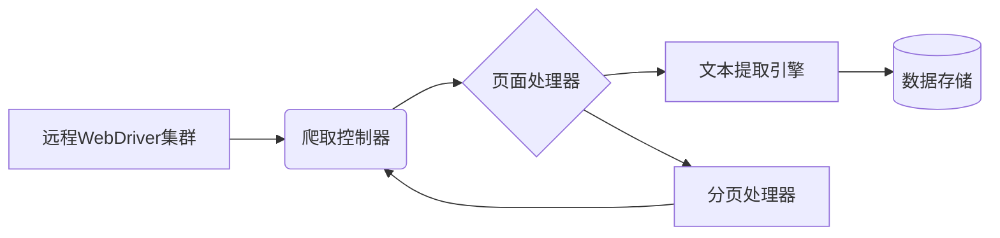

# 网页内容爬取系统需求文档

## 1. 背景与目标
**项目背景**：为支持大规模网页文本数据采集与分析，需构建基于远程WebDriver的自动化爬取系统。用户已提供远程WebDriver地址：`http://172.16.101.252:4444/wd/hub`。

**核心目标**：
- 连接远程WebDriver服务
- 自动爬取提交页面的**完整文本内容**
- 实现高效稳定的数据采集流程
- 支持异常处理和日志记录

## 2. 功能需求

### 2.1 远程WebDriver连接
- **认证机制**：支持基础认证（如需要）
- **浏览器配置**：
  - 默认使用无头模式（Headless）提升性能
  - 支持Chrome/Firefox多浏览器适配
  - 自定义超时时间（默认30秒）

### 2.2 页面内容爬取
- **智能等待机制**：
  - 显式等待页面核心元素加载（如`<body>`标签）
  - 支持动态内容渲染（Ajax/SPA页面）
- **内容提取规则**：
  - 提取`<body>`内所有文本节点
  - 保留段落结构（`<p>`标签自动换行）
  - 过滤无关内容（广告/脚本代码）
- **分页处理**：
  - 自动识别“下一页”按钮
  - 支持多页连续爬取（最大深度可配置）

### 2.3 数据处理与输出
- **数据清洗**：
  - 移除不可见字符（如`\xa0`）
  - 合并连续空白符
- **输出格式**：
  - UTF-8编码文本文件（.txt）
  - JSON格式（含URL/爬取时间戳）
- **存储路径**：
  ```python
  ./output/{日期}/{域名}_{时间戳}.txt
  ```

### 2.4 异常处理
- **错误类型**：
  - 网络超时（自动重试3次）
  - 元素定位失败
  - 远程服务不可用
- **恢复机制**：
  - 保存失败URL至`error.log`
  - 断点续爬功能

## 3. 技术实现方案

### 3.1 系统架构


### 3.2 核心代码模块
```python
from selenium.webdriver import Remote
from selenium.webdriver.common.desired_capabilities import DesiredCapabilities
from selenium.webdriver.support.ui import WebDriverWait

# 初始化远程驱动
def init_driver(remote_url):
    driver = Remote(
        command_executor=remote_url,
        desired_capabilities=DesiredCapabilities.CHROME
    )
    driver.set_page_load_timeout(30)
    return driver

# 页面内容爬取
def scrape_page(driver, url):
    driver.get(url)
    WebDriverWait(driver, 15).until(
        lambda d: d.find_element(By.TAG_NAME, "body")
    )
    return driver.find_element(By.TAG_NAME, "body").text

# 异常重试装饰器
def retry(times=3):
    def decorator(func):
        def wrapper(*args, **kwargs):
            # 重试逻辑实现
        return wrapper
    return decorator
```

### 3.3 关键配置参数
| 参数 | 默认值 | 说明 |
|------|--------|------|
| `PAGE_WAIT_TIMEOUT` | 15秒 | 页面加载最大等待时间 |
| `MAX_PAGE_DEPTH` | 5 | 最大翻页深度 |
| `RETRY_COUNT` | 3 | 失败重试次数 |
| `OUTPUT_DIR` | ./output | 数据存储目录 |

## 4. 部署与运行

### 4.1 环境要求
- **Python 3.8+**
- 依赖库：
  ```requirements
  selenium>=4.0
  beautifulsoup4
  lxml
  ```

### 4.2 执行流程
1. 初始化远程WebDriver连接
2. 读取URL列表（`urls.txt`）
3. 循环处理每个URL：
   - 爬取主页面内容
   - 检测并处理分页
   - 清洗保存文本数据
4. 生成运行报告：
   ```report
   [2025-06-20] 成功: 23页 | 失败: 2页 | 耗时: 02:15
   ```

### 4.3 监控指标
- WebDriver会话状态
- 页面爬取速度（页/分钟）
- 内存/CPU使用率
- 失败率统计

## 5. 风险控制
1. **反爬规避**：
   - 随机化操作间隔（0.5-2秒）
   - 轮换User-Agent
2. **资源限制**：
   - 单任务最大运行时间（1小时）
   - 每日URL处理上限（1000个）
3. **法律合规**：
   - 自动遵守`robots.txt`规则
   - 禁止爬取敏感数据

> 附件：  
> [示例代码模板](https://github.com/seleniumbase/SeleniumBase)  
> [WebDriver协议文档](https://www.w3.org/TR/webdriver/)  

---
**版本控制**：  
`V1.0` - 2025-06-20 - 初稿  
`V1.1` - 2025-06-25 - 增加分页处理模块（待评审）  

> 本需求文档依据Selenium最佳实践和分布式爬虫架构设计，满足远程WebDriver集群的文本采集需求。